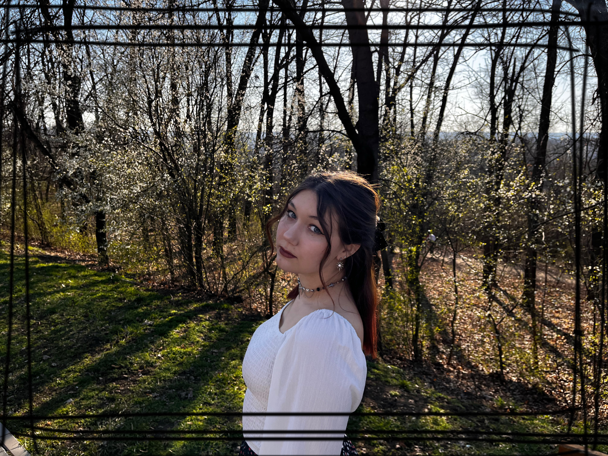

# Привет, ребятки, проверка связи
***
### Это я

***
## Обо мне 
***
- Меня зовут Бурцева Дарья и я студент в FMI USM

- У меня гуманитарный склад ума, до сих пор не понимаю как попала в IT

 - Вечно чем-то занятый человек
***

## Мое любимое времяпрепровождение
***
- Видеоигры, приоритетно в стиле интерактивного кино

- Различное рукодельничество (написание картин, плетение из бисера, вязание и т.д.)
***
## Языки программирования 
***
#### Знаю (middle lvl):
- Python 

##### А так же технологии:
- HTML & CSS
- PostgreSQL

#### Изучаю: 
- JavaScript
- PHP

#### Планирую изучать : 
- PHP

***
### Контактные данные

- Email : burteva.daria@gmail.com
- Telegram: @whokilledwakari
